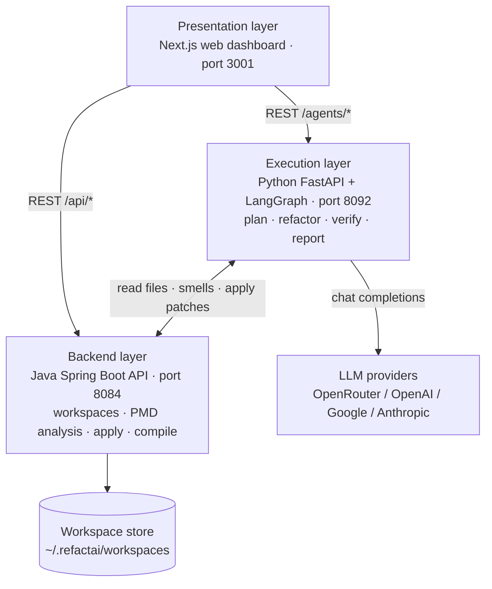
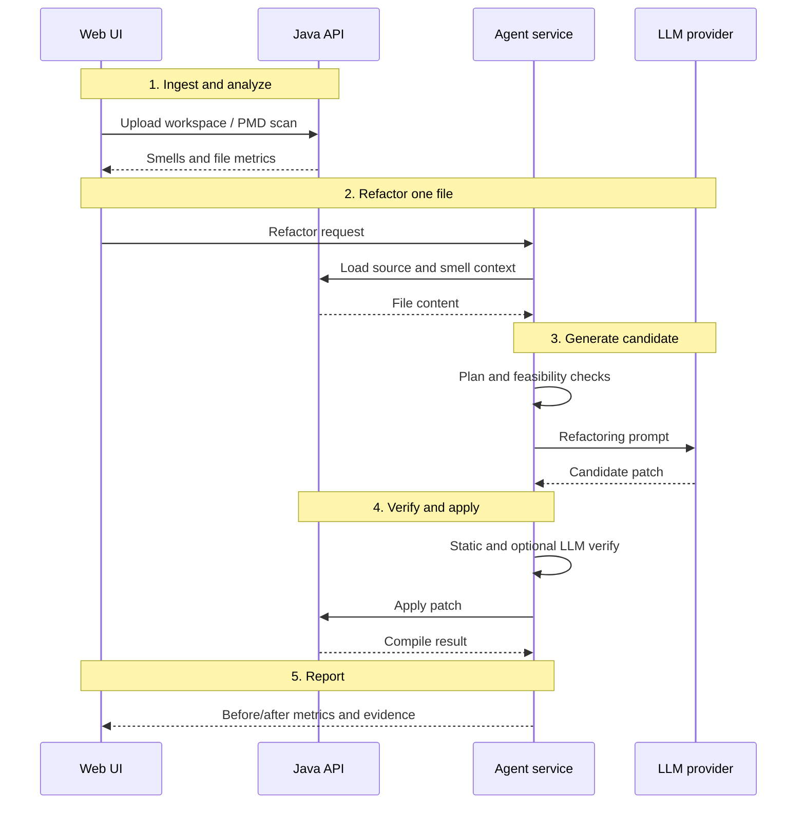
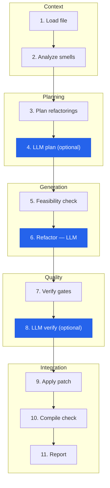

# REFINE

> **Double-blind review notice:** This public repository is anonymized for peer review.
> Author names, affiliations, and institution-specific paths have been removed or neutralized.

**Evidence-aware multi-agent system for smell-driven Java refactoring.**

REFINE detects code smells, plans and applies LLM-assisted refactorings, verifies each candidate with automated gates, and records a full audit trail — from interactive single-file refactors to large batch runs across multiple LLM providers.

[](LICENSE)
[](https://adoptium.net/)
[](https://www.python.org/)
[](https://nodejs.org/)

---

## Contents

- [What REFINE does](#what-refine-does)
- [Try it in 5 minutes](#try-it-in-5-minutes)
- [Systems you can test](#systems-you-can-test)
- [Using the dashboard](#using-the-dashboard)
- [Install and run](#install-and-run)
- [Architecture](#architecture)
  - [System overview](#system-overview)
  - [Refactoring execution flow](#refactoring-execution-flow)
  - [Agent pipeline](#agent-pipeline)
- [Configuration](#configuration)
- [Repository layout](#repository-layout)
- [Development](#development)
- [Troubleshooting](#troubleshooting)
- [License](#license)

---

## What REFINE does

| Capability | Description |
|------------|-------------|
| **Workspace ingestion** | Upload Java projects (ZIP) or clone from Git; each project becomes an isolated workspace |
| **Static analysis** | PMD-based smell detection with custom rulesets; file- and project-level metrics |
| **Guided refactoring** | Smell-aware planning, feasibility checks, LLM-generated patches, and accept/reject verification |
| **Batch processing** | Refactor many files in one run; compare multiple LLM providers on the same baseline |
| **Evidence & export** | Saved refactoring reports, before/after metrics, and Excel workbooks |

**Analysis works without an API key.** LLM-assisted refactoring requires an [OpenRouter](https://openrouter.ai/keys) key (or direct provider keys — see Configuration).

---

## Try it in 5 minutes

### 1. Start REFINE

```bash
git clone https://github.com/ResearchAnonymized/REFINE.git
cd REFINE

./scripts/setup.sh
cp agents/.env.example agents/.env    # set OPENROUTER_API_KEY for LLM refactoring

./start-refine.sh
```

Open **http://127.0.0.1:3001**

### 2. Upload the bundled demo project

```bash
cd examples/sample-java-repo
zip -r ../sample-java-repo.zip .
```

In the UI: **Project Hub → Upload** → choose `sample-java-repo.zip`.

### 3. Analyze and refactor

1. Open the new workspace → **Run analysis** (PMD smell scan).
2. Pick `Calculator.java` → **AI Refactoring** (controlled, single-file).
3. Review the proposed change, metrics, and verification gates → accept or reject.
4. Optional: save the report or export metrics to Excel.

Verify the stack:

```bash
./scripts/verify-install.sh
```

---

## Systems you can test

REFINE is designed for **real open-source Java codebases**, not toy snippets. You can start with the included demo, then move to well-known OSS projects.

### Included demo

| Project | Location | Notes |
|---------|----------|-------|
| **Calculator** | [`examples/sample-java-repo/`](examples/sample-java-repo/) | Intentional smells: long method, god class, data clumps. Zip and upload. |

### Recommended OSS Java systems

These **15 representative systems** cover libraries, build tools, parsers, and desktop applications at different scales:

| Project | Type | Scale | Start here? | Repository |
|---------|------|-------|:-----------:|------------|
| JUnit 4 | Testing framework | ~20 KLOC | ✅ | [junit-team/junit4](https://github.com/junit-team/junit4) |
| SLF4J | Logging facade | ~20 KLOC | ✅ | [qos-ch/slf4j](https://github.com/qos-ch/slf4j) |
| jsoup | HTML parser | ~29 KLOC | ✅ | [jhy/jsoup](https://github.com/jhy/jsoup) |
| Mockito | Mocking framework | ~48 KLOC | ✅ | [mockito/mockito](https://github.com/mockito/mockito) |
| Logback | Logging framework | ~59 KLOC | | [qos-ch/logback](https://github.com/qos-ch/logback) |
| GanttProject | Project management | ~86 KLOC | | [bardsoftware/ganttproject](https://github.com/bardsoftware/ganttproject) |
| JHotDraw | GUI framework | ~122 KLOC | | [werner-duvaud/jhotdraw](https://github.com/werner-duvaud/jhotdraw) |
| Checkstyle | Static analysis | ~188 KLOC | | [checkstyle/checkstyle](https://github.com/checkstyle/checkstyle) |
| JEdit | Text editor | ~193 KLOC | | [RMTT/jEdit](https://github.com/RMTT/jEdit) |
| Eclipse Collections | Collections | ~214 KLOC | | [eclipse/eclipse-collections](https://github.com/eclipse/eclipse-collections) |
| Apache Ant | Build tool | ~239 KLOC | | [apache/ant](https://github.com/apache/ant) |
| Apache Xerces-J | XML parser | ~297 KLOC | | [apache/xerces2-j](https://github.com/apache/xerces2-j) |
| ArgoUML | UML modeling | ~332 KLOC | | [argouml/argouml](https://github.com/argouml/argouml) |
| Guava | Core utilities | ~475 KLOC | | [google/guava](https://github.com/google/guava) |
| JabRef | Reference manager | ~516 KLOC | | [JabRef/jabref](https://github.com/JabRef/jabref) |

**How to use an external project:** clone or download → ZIP the project root → upload in Project Hub → run PMD analysis → refactor one file, then batch.

More detail: [`examples/README.md`](examples/README.md).

<details>
<summary><strong>Scale guide (Java files, indicative)</strong></summary>

| Project | Java files | Classes | Methods |
|---------|----------:|--------:|--------:|
| jsoup | 97 | 206 | 1,250 |
| SLF4J | 155 | 151 | 912 |
| JUnit 4 | 219 | 246 | 1,179 |
| Mockito | 521 | 587 | 2,138 |
| GanttProject | 570 | 837 | 4,727 |
| JEdit | 615 | 1,143 | 5,883 |
| Logback | 661 | 660 | 2,735 |
| JHotDraw | 685 | 773 | 5,897 |
| Apache Ant | 993 | 1,365 | 10,184 |
| Eclipse Collections | 997 | 1,360 | 16,502 |
| Apache Xerces-J | 1,109 | 1,308 | 8,004 |
| ArgoUML | 1,687 | 2,017 | 11,846 |
| Guava | 1,995 | 4,139 | 21,018 |
| Checkstyle | 2,273 | 2,839 | 7,215 |
| JabRef | 2,707 | 3,573 | 20,262 |

Production sources only; test paths excluded. Counts are scale indicators from static scans.

</details>

---

## Using the dashboard

| Area | What you do |
|------|-------------|
| **Project Hub** | Upload ZIP workspaces, view file counts, run workspace-wide PMD analysis |
| **Code Analysis** | Browse smells, severity, and file-level metrics across a project |
| **AI Refactoring** | Interactive single-file refactor with plan → generate → verify → apply |
| **Batch Refactor** | Queue many files; optional multi-LLM comparison on the same baseline |
| **Saved reports** | Reopen prior refactoring runs with before/after code and metrics |
| **Excel export** | Download workbooks with refactoring evidence and metric summaries |

### Typical workflow

```
Upload workspace → PMD analysis → pick file(s) → refactor → review gates → save report / export
```

### What gets measured

- PMD rule violations (before / after)
- Structural metrics (LOC, complexity proxies, file size)
- Refactoring acceptance, similarity checks, and optional LLM verification
- Persisted audit trail per file and per batch run

---

## Install and run

### Prerequisites

| Tool | Version |
|------|---------|
| Java (JDK) | 21+ |
| Maven | 3.8+ |
| Node.js | 18+ |
| Python | 3.10+ |
| OpenRouter API key | Required for LLM refactoring; optional for analysis only |

### Commands

```bash
./scripts/setup.sh              # first-time setup
./start-refine.sh               # start web + backend + agents
./start-refine.sh status        # health check
./start-refine.sh stop          # stop all services
```

Default URL: **http://127.0.0.1:3001**

| Service | Port |
|---------|------|
| Web UI | 3001 |
| Backend API | 8084 |
| Agents | 8092 |

Override ports in `config/ports.env`.

Optional smoke test (after uploading a project):

```bash
API_BASE=http://127.0.0.1:8084/api AGENTS_BASE=http://127.0.0.1:8092 \
  ./scripts/e2e-refactai-smoke.sh
```

---

## Architecture

REFINE is organized in three runtime layers plus external LLM providers. The **web frontend** drives the workflow; the **Java backend** owns workspaces and static analysis; the **Python execution layer** orchestrates multi-agent refactoring.

### System overview



| Layer | Technology | Port | Responsibility |
|-------|------------|------|----------------|
| **Presentation** | Next.js (`web/app/`) | 3001 | Operator UI — upload projects, browse analysis, trigger refactors, review evidence |
| **Backend** | Java / Spring Boot (`backend/`) | 8084 | Workspaces, PMD smell detection, metrics, applying patches, compilation checks |
| **Execution** | Python / FastAPI + LangGraph (`agents/`) | 8092 | Multi-agent workflow — plan, LLM refactor, verification gates, reporting |
| **External** | OpenRouter or direct LLM APIs | — | Model inference for planning, refactoring, and optional LLM verification |

### Refactoring execution flow

End-to-end path when a user refactors one file from the dashboard:



**Batch mode** repeats steps 2–5 for many files (and can run multiple LLM providers in parallel on the same baseline).

### Agent pipeline

Inside the execution layer, each refactoring pass follows a **vertical LangGraph workflow** (11 nodes), grouped into five phases below. Blue nodes call an LLM; grey nodes are rule-based or backend-backed.



**Pipeline phases**

| Phase | Steps | What happens |
|-------|-------|----------------|
| Context | 1–2 | Load Java source; attach PMD smell and metric context |
| Planning | 3–4 | Rule-based plan; optional LLM refinement of the plan |
| Generation | 5–6 | Size/safety gates; LLM produces a candidate patch |
| Quality | 7–8 | Static verification gates; optional LLM review |
| Integration | 9–11 | Write to workspace (if enabled); compile check; save report |

Implementation details: [`agents/AGENT_ARCHITECTURE.md`](agents/AGENT_ARCHITECTURE.md)

```bash
curl -s http://127.0.0.1:8092/agents/health | jq .
```

---

## Configuration

| File | Purpose |
|------|---------|
| `agents/.env` | API keys, models, multi-agent LLM mode |
| `config/ports.env` | Ports and UI feature flags |

```bash
cp config/ports.env.example config/ports.env
cp agents/.env.example agents/.env
```

**Multi-agent LLM mode** (`MULTI_LLM_AGENT_MODE` in `agents/.env`):

| Value | Behavior |
|-------|----------|
| `off` (default) | Only the refactoring step uses the LLM |
| `full` | Planner, refactorer, and verifier each call the LLM |

See `config/multi-agent.env.example` for multi-provider routing.

---

## Repository layout

| Path | Role |
|------|------|
| `agents/` | Agent orchestration service |
| `backend/` | Java API and analysis engine |
| `web/app/` | Web dashboard |
| `rulesets/` | PMD rule definitions |
| `examples/` | Demo Java project and OSS testing guide |
| `config/` | Port and feature-flag templates |
| `scripts/` | Setup, start, verify, smoke tests |

---

## Development

```bash
cd agents && pip install -r requirements.txt pytest
python -m pytest -q --ignore=test_openrouter.py

cd backend/server && mvn test
```

See [CONTRIBUTING.md](CONTRIBUTING.md).

---

## Troubleshooting

| Issue | What to try |
|-------|-------------|
| Backend won't start | `./scripts/setup.sh`; free port 8084 |
| Agents unhealthy | `pip install -r agents/requirements.txt` |
| LLM errors | Set `OPENROUTER_API_KEY` in `agents/.env` |
| Upload fails | Use a ZIP of the project root; avoid nested archives |
| Slow on large repos | Start with `examples/sample-java-repo` or SLF4J/jsoup |

Logs (gitignored): `backend/server.log`, `agents/agents.log`, `frontend.log`

Security: [SECURITY.md](SECURITY.md)

---

## License

MIT — see [LICENSE](LICENSE). Copyright Anonymous Authors (anonymized for double-blind review).
